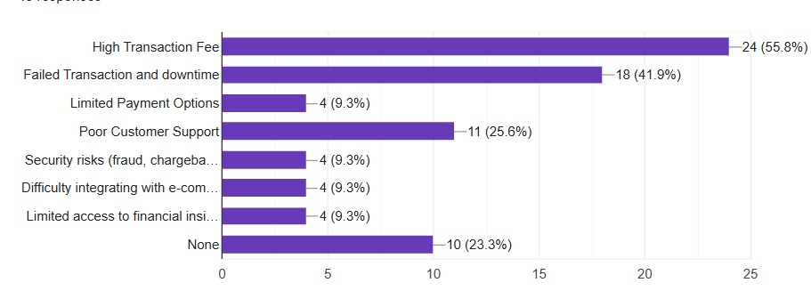
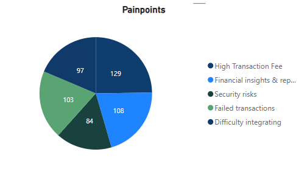
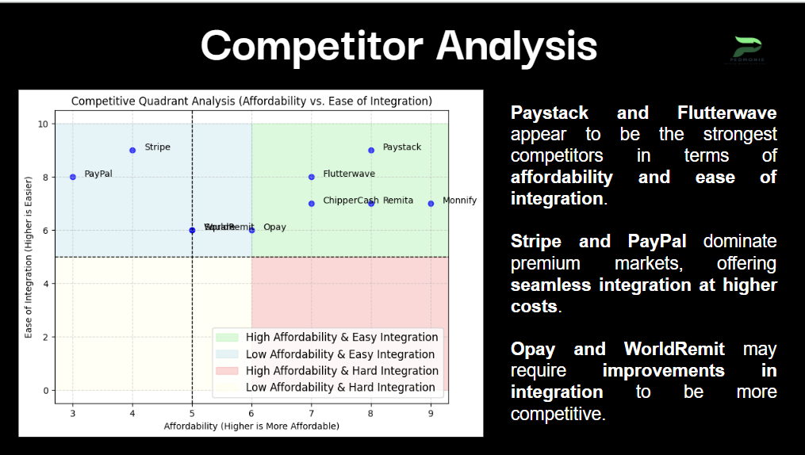
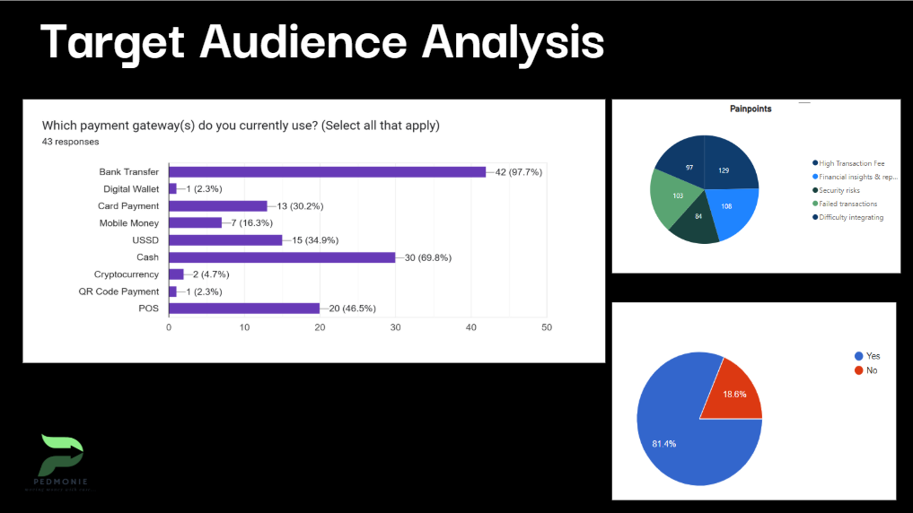
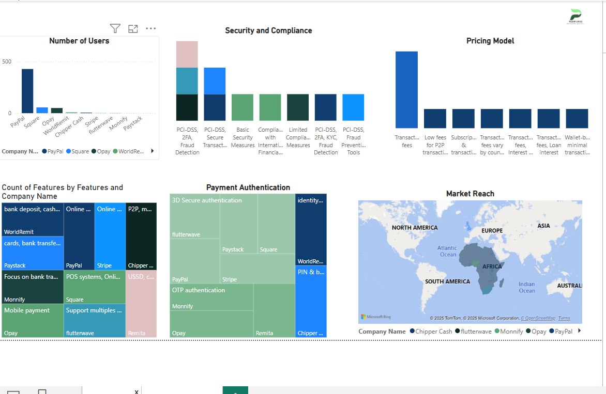

# Market-Research-Competitor-Analysis-for-PedMonie

# Project Overview
PedMonie is developing a unified digital payment solution that consolidates mobile money, bank transfers, and card payments into a seamless system. Our research aimed to: analyze the current digital payment landscape, evaluate key competitors, identify pain points and preferences of businesses using digital payments, and provide strategic recommendations to enhance PedMonie's market positioning.

# Research Objectives
  1. Analyze the Digital Payment Landscape: Understand the African digital payment market's growth trends, challenges, and opportunities.
  2. Evaluate Competitors: Compare key players like Paystack, Flutterwave, and others to identify gaps and opportunities.
  3. Understand Target Audience Needs: Identify the pain points and preferences of businesses and freelancers using digital payments.
  4. Provide Strategic Recommendations: Offer actionable insights to help PedMonie differentiate itself in the market.

# Methodology
We employed secondary data analysis and primary market surveys to gather insights.
### Key Methodologies:
- Competitor Analysis: Evaluated major digital payment providers based on features, market reach, and competitive positioning.
- Market Surveys: Collected insights on preferred payment methods, challenges, and user satisfaction.
- SWOT Analysis: Identified PedMonie's strengths, weaknesses, opportunities, and threats.
### Data Sources:
- Industry reports from Statista, McKinsey, and KPMG.
- Competitor websites and product documentation.
- Survey responses from SMEs and freelancers.

# Key Findings
Market Growth: The digital payment market is projected to grow by 15.9% globally by 2029.
Pain Points: Businesses face challenges like high transaction fees, payment failures, and limited integration options.

Competitor Landscape: Competitors like Paystack and Flutterwave lead in affordability and ease of integration, but there’s room for differentiation.

Target Audience Needs: Businesses prioritize low transaction fees, seamless integrations, and reliable transaction processing

Our surveys revealed the following:
- Preferred Payment Methods: Bank transfers (69.8%), mobile money (34.9%), and card payments (16.3%).
- Pain Points: High transaction fees (55.8%), failed transactions (41.9%), and security risks (23.3%).
- Adoption Readiness: Freelancers and SMEs are ready to adopt digital payment solutions if they are affordable, secure, and easy to integrate.

# Recommendations
 1. Unified Payment Channels: Consolidate mobile money, bank transfers, and card payments into a single platform.Enhanced Security: Implement robust fraud protection and compliance measures to build trust.
 2. Competitive Pricing: Offer low transaction fees and transparent pricing to attract SMEs and freelancers.
 3. Localized Solutions: Tailor payment options to meet the unique needs of African businesses.
 4. AI-Driven Risk Management: Explore innovative solutions to enhance fraud detection and risk management.

# Team
This project was a collaborative effort by:
- Kudipmfon Paul Okon
- Chinaemelum Ndidi-Chukwuka
- Emmanuel Osit
- Ebipre Harrison Bruce

### The Dashboard

